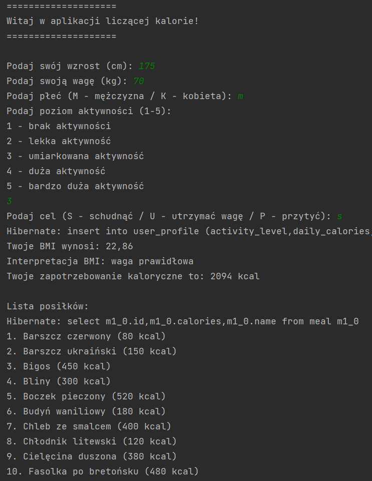
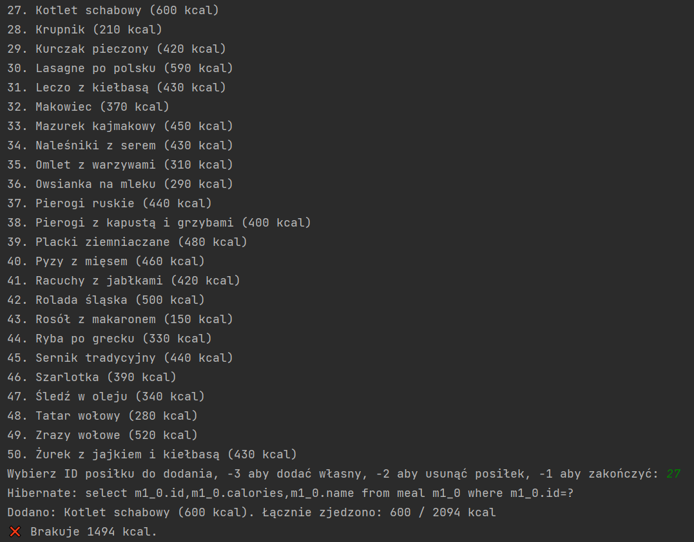
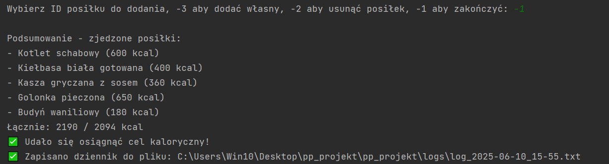

# Aplikacja dietetyczna - Projekt Konsolowy (Java + Spring Boot + Baza H2)

_Autor: Przemysław Naja_

## Opis

Aplikacja konsolowa wspomagająca użytkownika w **zarządzaniu kaloriami i planowaniu diety**.

Użytkownik wprowadza swoje dane (waga, wzrost, płeć, poziom aktywności, cel), a aplikacja:
- oblicza BMI i interpretuje wynik,
- wyznacza dzienne zapotrzebowanie kaloryczne,
- umożliwia dodawanie spożytych posiłków,
- kontroluje przekroczenie lub niedobór kalorii,
- generuje dziennik posiłków w pliku `.txt`.

---

## Funkcjonalności

### ✅ Obliczenie zapotrzebowania kalorycznego i BMI
- Użytkownik podaje wzrost, wagę, wiek, płeć, aktywność i cel (schudnąć, utrzymać, przytyć).

### ✅ Lista posiłków i możliwość dodania własnych
- Można wybrać posiłek z bazy danych lub dodać własny.

### ✅ Śledzenie zjedzonych kalorii
- Sumowanie kalorii i porównanie z celem.
- Ostrzeżenia przy przekroczeniu limitu.

### ✅ Eksport raportu do pliku
- Dziennik posiłków generowany w formacie tekstowym (`logs/log_YYYY-MM-DD_HH-mm.txt`)

---

## Screenshots

### Start aplikacji

### Dodawanie posiłku

### Podsumowanie i zapis

---

## 🧪 Testy jednostkowe

### Testowane komponenty:
- `UserProfileService` 
- `UserProfileController`

Testy znajdują się w: `src/test/java/com.pp_projekt.pp_projekt/`

---

## Technologie

- Java 17
- Spring Boot 3.x
- Spring Data JPA
- Baza danych H2 
- Maven
- JUnit 5

---

## Uruchamianie aplikacji

1. `mvn clean install`
2. `mvn spring-boot:run`

---

